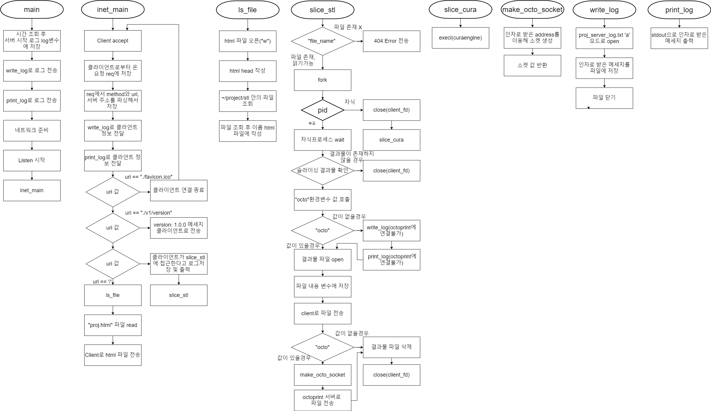

## 2020-2 시스템 프로그래밍 텀 프로젝트
---
### 프로젝트 명: 클라우드 슬라이싱 서버 

### 프로젝트 멤버:
1. 이준상: 프로그램 개발 및 CuraEngine이 설치되어있는 커스텀 이미지 생성, Octoprint 서버 준비

### 프로젝트 소개 및 개발내용 소개
* 프로젝트 소개: 3D 모델링 파일을 CuraEngine을 이용하여 3D프린터가 이해할 수 있는 파일로 변환한 뒤  3D프린터와 연결되어있는 Octoprint 서버(라즈베리파이)로 전송하는 프로그램
* 개발 내용 소개:
    * 개요: 3D 모델을 3D 프린터가 출력할 수 있는 파일로 변환하는 과정을 슬라이싱이라고 한다. 본 프로그램에서는 서버 안에 저장되어있는 3D 모델링파일(.stl)을 웹에서 사용자가 선택하면 선택한 파일을 CuraEngine을 이용하여 슬라이싱하고 나온 결과물(.gcode)을 사용자에게 돌려주고, Octoprint 서버에도 파일을 전송하여 결과물을 출력할 수 있게 해준다.
    * 사용 언어: C
    * 사용 프로그램: 
      * Ultimaker/CuraEngine(https://github.com/Ultimaker/CuraEngine)
      * Octoprint(https://octoprint.org/)

### 개발 결과물 소개
다이어그램: 
  

### 개발 결과물 사용하는 방법:
    1. 웹페이지 접속
    2. 원하는 모델링 파일 선택
### 프로그램 구동 화면 스크린샷

### 개발 결과물의 필요성 및 활용방안:
    * 사용자의 컴퓨터에서 직접 슬라이싱을 할 경우에는 컴퓨터의 리소스를 잡아먹기 때문에, 클라우드에 서버를 올려 클라우드에서 작업을 대신 처리하도록 한다.
    * 일반적으로 3D 프린터에 작업물을 전송하기 위해선 sd카드에 작업물을 담아 프린터로 전송하거나 usb를 이용해서 프린터를 전송해야 한다. 하지만, octoprint 프로그램을 라즈베리파이에 탑재해 프린터 보드와 usb로 연결해서 운영하면 결과물을 네트워크로 octoprint 서버로 전송하면, octoprint 서버에서 프린터 보드로 작업물을 전송해서 사용자의 수고를 덜어준다.